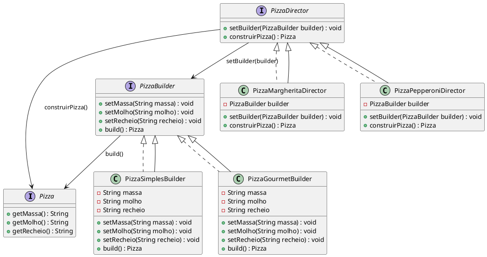

# Builder

## Gabriel Ferreira Lima Brito (20212TADSSAJ0015)

[@gabrielflb](https://github.com/gabrielflb)

<!-- @include: ../../../includes/seminario-1-gabrielflb/README.md -->

## Luis Miguel de Jesus Oliveira (20211TADSSAJ0005)

[@LuisMiguelADS](https://github.com/LuisMiguelADS)

<!-- @include: ../../../includes/seminario-1-LuisMiguelADS/README.md -->

## Yuri Pêpe do Espírito Santo (20221TADSSAJ0005)

[@YuriPepezin](https://github.com/YuriPepezin)

<!-- @include: ../../../includes/seminario-1-YuriPepezin/ApYuri.md -->

## Leandro

<figure>

```plantuml

<!-- @include: ../../../includes/Leandro/builder/build.plantuml -->

```

<figcaption> Exemplo de builder</figcaption>
</figure>

# João Augusto

<figure>


<figcaption> Exemplo de builder </figcaption>
</figure>


## Salvador

```@startuml
class Carro {
    - motor: String
    -  Transmissao: String
    - color: String
    - doors: int
    + setmotor(motor: String): void
    + setTransmissao( Transmissao: String): void
    + setColor(color: String): void
    + setDoors(doors: int): void
    + toString(): String
}

interface CarroBuilder {
    + buildmotor(): void
    + buildTransmissao(): void
    + buildColor(): void
    + buildDoors(): void
    + getCar():Carro
}

class CarroEsportivoBuilder {
    -Carro:Carro
    + buildmotor(): void
    + buildTransmissao(): void
    + buildColor(): void
    + buildDoors(): void
    + getCar():Carro
}

class CarroDirector {
    - builder:CarroBuilder
    +CarroDirector(builder:CarroBuilder)
    + constructCar(): void
}

CarBuilder <|-- CarroEsportivoBuilder
CarDirector -->CarroBuilder
CarDirector -->Carro
CarroEsportivoBuilder -->Carro
@enduml
