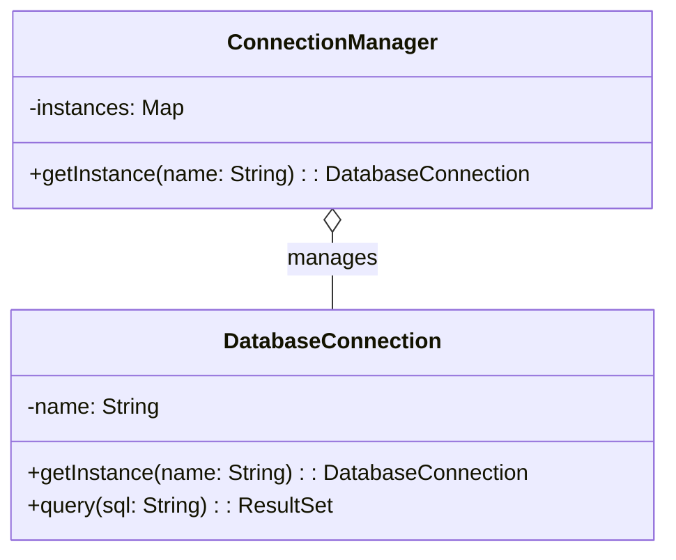

# Multiton

## Guilherme Sampaio Oliveira (20221TADSSAJ0011)
[@GuiSamp](https://github.com/GuiSamp)

<!-- @include: ../../../includes/seminario-1-GuiSamp/Multiton.md -->


## Rian Silva da Fonseca (20221TADSSAJ0002)
[@RiansFonseca](https://github.com/RiansFonseca)

<!-- @include: ../../../includes/seminario-1-RiansFonseca/README-MULTITON.md -->


## Leandro

```java

public enum Configuracao {
    localDb("jdbc:mysql://localhost:3306/meuBanco",
                "admin",
                "senha123"),
    remotoDb("jdbc:mysql://remotehost:3306/outroBanco",
                "root",
                "rootpassword");

    private final String urlBancoDeDados;
    private final String usuario;
    private final String senha;

    private Configuracao(String urlBancoDeDados, String usuario,String senha){
        this.urlBancoDeDados = urlBancoDeDados;
        this.usuario = usuario;
        this.senha = senha;
    }

    public String getSenha() {
        return senha;
    }

    public String getUrlBancoDeDados() {
        return urlBancoDeDados;
    }

    public String getUsuario() {
        return usuario;
    }
    public static void main(String[] args) {
        Configuracao.localDb.getSenha();
    }
    
}
```


## Salvador



### **Descrição do Diagrama**

1. **DatabaseConnection**: Representa a classe para as conexões com o banco de dados. Inclui o método `getInstance(name: String)` para obter uma instância da conexão associada a um nome específico. O método `query(sql: String)` é um exemplo de operação que a conexão pode realizar.
  
2. **ConnectionManager**: Gerencia as instâncias das conexões. Mantém um mapa (ou dicionário) das instâncias de `DatabaseConnection` associadas a diferentes nomes. O método `getInstance(name: String)` permite obter a instância correta com base no nome.


